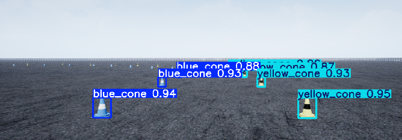

# FSAE Autonomous System: Perception and Path Planning

This repository contains the software pipeline for the autonomous vehicle (FSAE), designed to operate in both the FSDS (Formula Student Driverless Simulator) and the real world. The system integrates computer vision (YOLOv8 + ZED2i), local trajectory calculation, and telemetry data publishing via ROS2.

### System Visualization

* **Local Mapping (Matplotlib):**


* **Simulator and Path Planning Integrated:**


* **Labeling the cones with YOLO and ZED2i.**


### Requirements
* `numpy`, `matplotlib`, `opencv-python`
* `ultralytics` (YOLOv8), `torch`
* `fsds` (Simulator API)
* `rclpy` (ROS2 Humble/Iron)
* `msgpack`

---

## 1. Perception Module (`perception.py`)
This module acts as the "eyes" of the vehicle. It is responsible for extracting the 3D positions of the track bounding cones using Artificial Intelligence and Stereoscopic Vision. It is designed to be hardware-agnostic, meaning the core logic applies to both the simulated ZED camera in FSDS and a physical ZED2i camera on the real car.

### How it works:
1. **Image Acquisition:** The system requests two simultaneous streams from the ZED camera:
   * **RGB Scene (`IMG_SCENE`):** A standard 2D color image used for object detection.
   * **Depth Map (`IMG_DEPTH`):** An uncompressed matrix of `float32` values where each pixel represents the absolute distance (in meters) from the camera to the object.
2. **2D Object Detection (YOLOv8):** The RGB frame is processed by a YOLOv8 neural network (accelerated via CUDA, if available). It detects the cones and outputs their 2D bounding boxes and classes (`0` for left/blue, `1` for right/yellow).
3. **2D to 3D Projection (Pinhole Camera Model):** To map a cone from a flat image to the real 3D world, the algorithm extracts the exact center pixel `(u, v)` of the YOLO bounding box and applies the camera's intrinsic parameters (`FX = 640.0`, `CX = 640.0`):
   * **Depth ($Z$):** Read directly from the Depth Map matrix at coordinates `[v, u]`.
   * **Lateral Position ($X$):** Calculated using geometric projection: $X = (u - C_x) \times \frac{Z}{F_x}$
4. **Spatial Filtering & Validation:**
   * **Range Filter:** Discards any detection outside the reliable physical threshold ($0.5m < Z < 35.0m$) or invalid `NaN` readings.
   * **Duplicate Removal (3D NMS):** Prevents a single physical cone from being counted twice by calculating the Euclidean distance between all detected points. If a new detection is closer than `1.2m` to an existing one, it is merged/discarded.

---

## 2. Local Path Planning (`path_local.py`)
Receives the filtered 3D cone point cloud from the perception module and calculates the optimal central trajectory for the vehicle. It features an asynchronous visualization thread using `matplotlib` to plot the map in real-time without blocking the control loop.

### Trajectory Calculation Logic:
1. **Separation:** Divides the cones into left side (class `0`) and right side (class `1`).
2. **Sorting:** Sorts both arrays in ascending order based on the Z-axis (depth) to process the closest cones first.
3. **Matching:** Finds the ideal pair for each left cone by verifying:
   * **Track Width Constraint:** The lateral distance (X-axis) must be between `2.0m` and `5.0m`.
   * **Alignment Constraint:** The depth difference (Z-axis) must be strictly less than `2.0m`.
4. **Waypoint Generation:** Once a valid pair is found, the navigation *waypoint* is generated exactly at the geometric midpoint:
   * $X_{waypoint} = \frac{X_{left} + X_{right}}{2}$
   * $Z_{waypoint} = \frac{Z_{left} + Z_{right}}{2}$

---

## 3. Main Node & ROS2 Integration (`main_pft.py`)
This is the Main Execution Loop. It connects the FSDS simulator, the Perception/Planning logic, and the ROS2 environment.

### Core Features:
* **Buffer Allocation Fix:** Overrides the default `msgpack` unpacker limit, increasing it from 1MB to 16MB. This is mandatory to prevent crashes when receiving massive uncompressed arrays like the FSDS Depth Maps.
* **ROS2 Publishers:**
  * `/waypoint_go` (`geometry_msgs/Point`): Publishes the 3D coordinates ($X, 0.0, Z$) of the immediate closest waypoint to guide the steering controller.
  * `/car_acceleration` (`std_msgs/Float32`): Linear acceleration on the X-axis extracted from the vehicle's IMU.
  * `/car_orientation` (`std_msgs/Float32MultiArray`): Orientation vector containing Euler angles `[Pitch, Roll, Yaw]` converted from the IMU's quaternions.

### How to Run

1. Launch the FSDS (Formula Student Driverless Simulator) environment.
2. Source your ROS2 workspace (Humble/Iron) and run the main script:
```bash
python3 main_pft.py