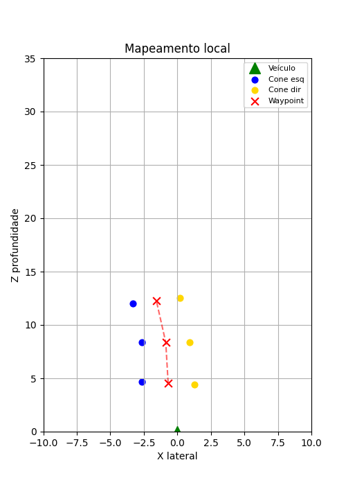
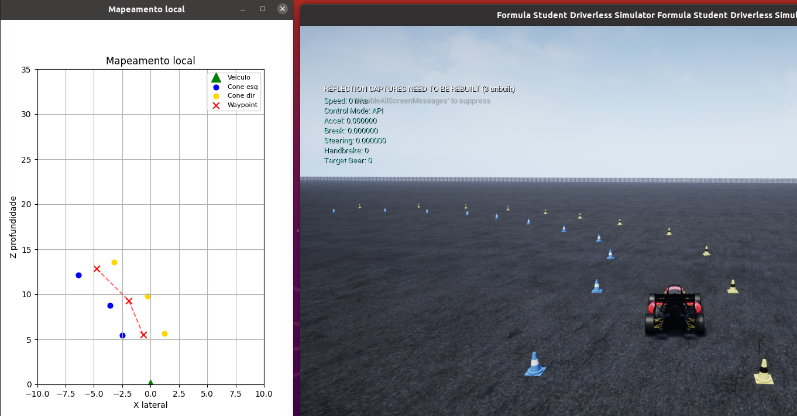

# PathPlanner: Local Mapping and Path Planning

This Python module implements the local path planner for the FSAE simulator and the autonomous vehicle. It processes the positions of track boundary cones (left and right) and calculates central *waypoints* to guide navigation. 

The module uses *threading* for real-time visualization with `matplotlib`, ensuring the plotting process does not block the main execution of the vehicle's telemetry or control loop.

### System Visualization

* **Local Mapping (Matplotlib):**


* **Simulator and Path Planning Integrated:**


### Requirements
* `numpy`
* `matplotlib`

### Input Structure
The `calcular_trajetoria` method expects a NumPy array with the shape `(N, 3)`, where each row represents a detected cone containing:
* **X (Lateral):** Position on the lateral axis in meters.
* **Z (Depth):** Distance ahead of the vehicle in meters.
* **Class/ID:** Identifier for the cone's side (`0` for left, `1` for right).

### Matching Logic and Constants
The algorithm follows these filtering constraints (configurable via class attributes):
* **`HORIZONTE_MAXIMO` (30.0m):** Ignores cones located beyond this distance.
* **`LARGURA_MINIMA` (2.0m)** and **`LARGURA_MAXIMA` (5.0m):** Acceptable lateral distance limits between a pair of cones.
* **`MAX_DIFF_Z` (2.0m):** Maximum depth difference allowed for two cones to be considered a valid pair.

### Path Planning and Waypoint Logic
The trajectory is generated by finding the geometric midpoint between valid cone pairs. The process works as follows:

1. **Separation and Filtering:** Cones are split into left (class `0`) and right (class `1`). Cones beyond the `HORIZONTE_MAXIMO` limit are discarded.
2. **Sorting:** The arrays are sorted in ascending order by the Z-axis (depth) to process the cones closest to the vehicle first.
3. **Matching:** For each left cone, the algorithm searches for a corresponding right cone. A pair is validated if:
   * The lateral distance (X-axis) is between `LARGURA_MINIMA` and `LARGURA_MAXIMA`.
   * The depth difference (Z-axis) is less than `MAX_DIFF_Z`.
   * If multiple right cones meet the criteria, the algorithm selects the one with the smallest depth error in Z.
4. **Midpoint Calculation:** After validating the pair, the *waypoint* is defined as the exact center between the two cones:
   * $X_{waypoint} = \frac{X_{esq} + X_{dir}}{2}$
   * $Z_{waypoint} = \frac{Z_{esq} + Z_{dir}}{2}$

### Complete Usage Example

```python
import numpy as np
from path_local import PathPlanner

# 1. Import and Initialization
# Starts the planner with real-time graphical visualization enabled
planner = PathPlanner(visualizar=True)

# 2. Data formatting (example)
# Simulated cone array: [X, Z, Class(0=left, 1=right)]
cones_detectados = np.array([
    [-2.0,  5.0, 0],
    [ 2.2,  5.1, 1],
    [-1.9, 10.0, 0],
    [ 2.5, 10.5, 1]
])

# 3. Result
# Returns an (N, 2) array containing [X, Z] for each calculated waypoint
waypoints = planner.calcular_trajetoria(cones_detectados)

print("Generated Waypoints:")
print(waypoints)